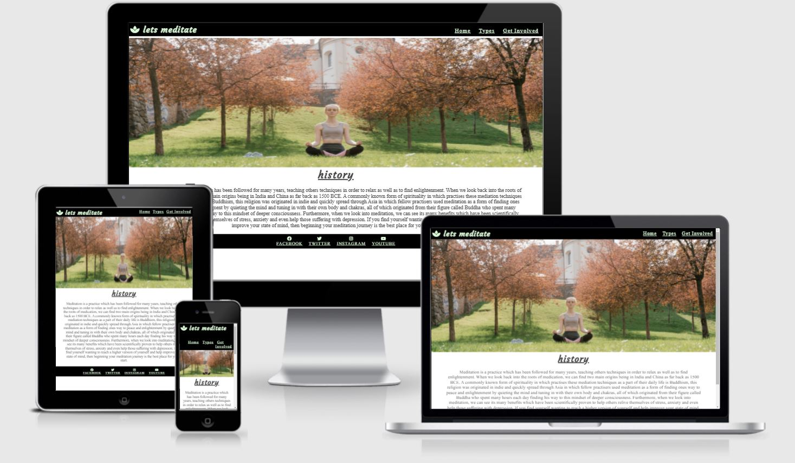
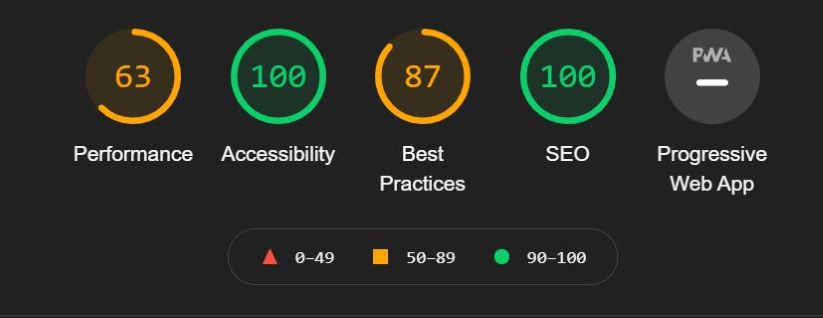

# Lets Meditate
The let's meditate website is for anyone that would like to adopt meditation into their daily life. The website offers users multiple ways they can use meditation throughout the day. It is aimed at people aged 35 to 44 and hopes to help those in stressfull jobs or busy families.

Users of the let's meditate website will find everything they need to know about different types of meditation. People relax in different ways, from reading books to gardening, everyone should have something in their life that helps them calm down after a long day. This website hopes to give people the tools to have a better look at life.

## Features

- navigation:

- In the top left of the landing page there is the website logo (lets meditate) which also links the the landing page when clicked.
- In the top right we have other page links. Theres home which is the very first page you land on, then types and get involved which takes you to different pages.
- The navigation bar is written in a calming font aswell as a calming colour. blue and green are concidered calm colours apossed to red. This will help people feel relax from the moment they opened the website.
The navigation is really easy to use and understand, the logo tells the user what the website is about and what they will find on other pages of the website.

## hero image

- The hero image shows a women in a field meditating, this will show users how easy it is to meditate.
- The hero image also shows a calm place with trees and grass, and colours like green, blue and orange.
- The women in the picture shows the age group the website is aimed at.
- The image doesnt cover the entire screen, the word history shows just below to make users interested and want to read on to learn more.

## The types page

- The types page is for all the types of meditation and shows us that their are lots of ways to meditate. Everyone is differnt and some people have more time than others, it also gives people to try different ways when feeling differnt things.
- This page is very simplistic, it shows a lotus flower which symbolize resurrections and new beginnings. giving people the hope of a new start.
- The page then has a breif description of each meditation type.

## Get involved

- The first thing that happens when landing on this page is a video will start to play along with some audio.
- The video shows a women breathing, this is to show people what they can do. the video can be paused if users dont want to watch it.
- The audio file is a 3 minute video about controled breathing, this can help people relax. The video can be paused or muted by the user.
- At the end of the page is a feedback form, this is so we can help users have a website that helps them by taking in feedback. 

## Footer

- The footer shows muiltple ways users can find more help on social media.
- The footer has links to facebook, twitter, instagram and youtube. All social media links open in a new tab. This is so users dont lose the lets meditate website.

## Testing

- I have tested this website in other browsers such as Chrome, Microsoft edge and Safari.

- My navigation is clear and easy to understand. users can read the logo and all page names because the text colour is clear against the black background.

- The form works and requires entry in every field, and will require a valid email address. The submit button also works.

## Bugs

(Fixed bugs)

- When i first coded the footer the link wouldnt open in a new tab.

- This was due to me forgetting to add the target = _blank attribute.

- By adding this everything worked as intended.

## Validator Testing

- HTML: no errors found when checking using the offical W3C validator.

- CSS: no errors were found when validating through the official (jigsaw) validator.

- Accessibility: I ran all my code throught the dev tool lighthouse.

## Unfixed bugs

couldnt style checkboxes to have a orange border or orange tick.

##  Deployment

- This website has been deployed using GitHub pages. I did this by...
    1. loacating the setting tab.
    2. Near the bottom it says pages.
    3. When clicked it brings you a new page.
    4. I then select main from the drop down menu.
    5. Then completed it by pressing save.

here is the live link to the lets meditate website [Lets meditate](https://jharvey125.github.io/Project-1/index.html)

## Sources

## Content

- The types page contents was inspired from this website [9 types of meditation](https://www.healthline.com/health/mental-health/types-of-meditation)

## Media

- All images and videos used are from the website [Pexels](https://www.pexels.com/)

- The audio file was used from the website [Freemindfullness](https://www.freemindfulness.org/download)